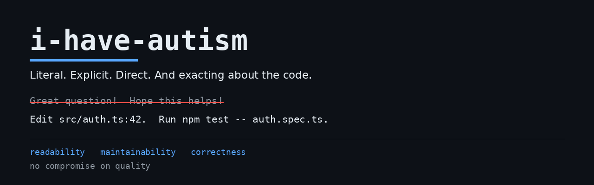

# i-have-autism

<p align="center">
  
</p>

<p align="center">
  <strong>Literal, explicit, direct. And exacting about the code.</strong><br>
  <sub>A coding-agent skill, measured against no-skill in A/B runs. Results in <a href="#evidence">Evidence</a>.</sub>
</p>

<p align="center">
  <a href="LICENSE"></a>
  <a href="actions/workflows/validate.yml"></a>
  
  
</p>

A skill for your coding agent that says what it means, names what it would otherwise leave implied, and holds the code to **readability, maintainability, and correctness — with no compromise on quality**.

Sibling to [i-have-adhd](https://github.com/ayghri/i-have-adhd). Same idea, different mechanism. That one is about working memory and dopamine. This one is about ambiguity and literalism.

## Contents

- [Why](#why) · [Install](#install) · [Works with](#works-with) · [What it does](#what-it-does)
- [Before and after](#before-and-after) · [The difference from i-have-adhd](#the-difference-from-i-have-adhd)
- [The parts](#the-parts) · [When it yields](#when-it-yields) · [Evidence](#evidence)
- [Manifesto](#manifesto--change-this-it-is-yours-now) · [Credit](#credit)

## Why

A coding agent defaults to a register built for a reader who skims: an analogy to set the scene, a
softener on the instruction, the actual step implied rather than written. For many readers that is fine.
For a reader who pays for every ambiguity, it is a tax on every sentence — and the same tax lands on the
code, where an implied precondition or a silent failure costs an afternoon.

This skill removes the tax. It is **one markdown file**. There is nothing to run, nothing to configure,
and it costs one line in your prompt.

Nothing about it is subtle, which is the point: it says the true thing first, writes down every step it
would otherwise skip, states disagreement on the line where it belongs, and refuses to trade correctness
for style.

## Install

Copy and paste into your CLI prompt:

```text
Install the i-have-autism skill/plugin from https://github.com/Siririn77/i-have-autism, refer to the repo's AGENTS.md for instructions.
```

Or see [INSTALL.md](INSTALL.md) for the per-client paths.

## Works with

One package, one manifest per client — the open [Agent Plugins](https://agent-plugins.org/) format, plus a
native manifest for the clients that predate it. Nothing is rewritten per platform.

| client | how it loads |
|---|---|
| **Claude Code** | `.claude-plugin/` manifest |
| **Codex** | `.codex-plugin/` manifest |
| **Cursor** | `.agents/plugins/` marketplace manifest |
| **Gemini CLI** | `gemini-extension.json` |
| **opencode** | `.opencode/command/` — copies the skill into place |
| **Any other agent** | paste [`AGENTS.md`](AGENTS.md), or point it at [`skills/i-have-autism/SKILL.md`](skills/i-have-autism/SKILL.md) directly |

If your client cannot read the package, the fix is a new manifest next to the existing ones — open an
issue and say which client, and it gets added. The skill body itself does not change.

## What it does

Two things, and they are one thing.

**The words.** Meaning is literal first. `spill the beans` arrives as beans, and the reader pays the translation on every sentence. So: no idioms, no metaphor where a literal sentence works. Every implicit step is written down, because **unstated is absent** — the gap you filled without noticing is the gap the reader falls into. Disagreement is stated on the first line, not wrapped in a question or a compliment. Social softeners are removed, because a softener placed on an instruction turns the instruction into nothing.

**The code.** The same reader reads the code — and the same person has to *change* it next week. So the code is held to three things at once, and quality is never the thing traded away:

- **Readable** — the next reader understands it on the first pass.
- **Maintainable** — the next editor changes it safely: one place to change, the obvious edit is the correct edit, failures are loud and early, a change is verifiable, and nothing load-bearing is implicit.
- **Correct** — right on the inputs the task never mentioned, not only the happy path. **Correctness is the floor under the other two, never the casualty.**

An ugly solution that is obvious beats a pretty one that must be decoded. After the work: a green run, then a post-mortem that reads your own code as a stranger's.

## Before and after

<table>
<tr>
<td width="50%">

### Before

> Great question! Let's think about this. Your auth flow has a few moving pieces: the middleware, the token verification, and the cookie handling. Looking at `src/auth.ts`, the `verifyToken` function (around lines 42–58) seems to be using an older `jsonwebtoken` API. One approach would be to update the package and rewrite that function. After making the change, you'd want to run the tests to confirm nothing breaks. By the way, you might also want to look at your dependency versions overall. Hope this helps!

</td>

<td width="50%">

### After

> Edit `src/auth.ts:42` to update the token validation.
>
> 1. Open `src/auth.ts`
> 2. Replace `verifyToken` (lines 42–58) with the snippet below
> 3. Run `npm test -- auth.spec.ts`
>
> If step 3 exits with `401`, the header is missing — add `Authorization` and rerun.
> Next: paste the first failing line.

</td>
</tr>
</table>

## The difference from i-have-adhd

| | i-have-adhd | i-have-autism |
| --- | --- | --- |
| Core problem | Working memory, dopamine | Ambiguity, literalism |
| Lead rule | Next action first | Meaning is literal first |
| What is added | Steps, wins, time estimates | No idioms, no implicit steps, direct disagreement |
| Code | — | Readability, maintainability, comments, correctness, post-mortem |

Both share the response shape (action first, numbered steps, no preamble). This one adds the language layer and the code layer.

## The parts

Full text in [SKILL.md](./skills/i-have-autism/SKILL.md).

- **Part 0 — Language.** Literal meaning, named implicit steps, one action per step, no social padding, direct disagreement, explicit names and errors, plain questions.
- **The two load-bearing rules.** KISS (the simplest thing that works) and DRY (one fact in one place).
- **Readability, maintainability, and correctness.** All three required; correctness never traded for the other two.
- **Part 1 — Code that reads.** 11 rules, from the reader's straight path to "the size of the task is the size of the edit".
- **Part 2 — Comments that earn their place.** 7 rules, including two lines in one voice and the four-question check.
- **Part 3 — The answer.** 10 rules for the shape of a reply.
- **Part 4 — Post-mortem.** Green run first, then read your own code as a stranger's; fix what you find, do not describe it.
- **Before you call it done.** The checklist: readability, maintainability, correctness and delivery.

## When it yields

Explaining in full, destructive actions, a debug spiral, real ambiguity, a rule that fights the task, a rule that fights the harness. And one refusal case: a genuinely harmful request gets the objection **before** the work, in three lines — what, who it hurts, what to do instead — and never a moralizing lecture.

## Evidence

Two controlled A/B runs (same task, same model, one arm given the skill and one not) are stored in this
repository, with **every artifact from both arms** and the scoring script.

> **`without-skill`** = the arm **without** the skill — the model's default register, shaped for a general reader.
> **`with-skill`** = the arm **with** the skill — the skill's register, shaped for a reader who pays for every ambiguity.

Same model in both arms (`deepseek-v4.1-flash`). Nothing else differs. So every difference below is
caused by one text file.

**Headline results** (all measured, all in `evals/`):

| | without-skill | with-skill |
|---|---|---|
| Post-mortem written after the code (run 1, 4 code tasks) | **0 / 4** | **4 / 4** |
| Post-mortem written after the code (run 2, 5 code tasks) | **0 / 5** | **5 / 5** |
| Caught a total rate-limiter bypass | no | **yes** |
| Caught a silent integer overflow | no | **yes** |
| Malformed input | silent `NaN` | **named error** |
| `Money` helper, same guarantees | 341 lines | **123 lines** |

- **[`evals/README.md`](evals/README.md)** — how to read the directory: which arm is which, what each
  file is, and where to find the two registers side by side.
- **[`evals/SIDE-BY-SIDE.md`](evals/SIDE-BY-SIDE.md)** — three pairs from the same question, the default
  register next to the skill's, with the differences marked.
- **[`evals/language-2026-10-08/`](evals/language-2026-10-08/)** — 18 files: 9 writing tasks × 2 arms.
  **This is where the two registers can be read against each other.**
- **[`evals/AB-report.md`](evals/AB-report.md)** — 10 tasks, 20 agents, language and response shape.
  Result: the post-mortem gate fired **4 of 4** code tasks in the with-skill arm, **0 of 4** in the without-skill.
- **[`evals/quality-2026-10-08/report.md`](evals/quality-2026-10-08/report.md)** — 6 tasks, 12 agents,
  code quality and style. Result: gate fired **5 of 5** (second independent confirmation), and it caught
  a total rate-limiter bypass and a silent integer overflow that the without-skill arm's artifacts shipped.

Both directories contain the raw deliverables from both arms, so the claims can be re-checked rather than
trusted. [`score_quality.py`](evals/quality-2026-10-08/score_quality.py) mechanically counts six
maintainability facts per file.

## Manifesto — change this, it is yours now

**This skill is not finished. It is a starting point that works, and it gets better every time someone
disagrees with it in public.**

You are invited to do all of the following. None of these requires permission, an application, or a
reason. A disagreement is enough.

- **Open a pull request.** Fix a rule, sharpen a wording, add a rule the skill is missing, delete a rule
  that costs more than it earns. One change per pull request. Say which rule it changes and why the change
  makes the reader's effort smaller. If it makes the reader's effort larger, say why it is still right.
- **Open an issue.** Two kinds are equally welcome: *"this rule is wrong"* and *"this rule is right but I
  cannot follow it"*. The second kind is more useful — a rule nobody can obey is a rule that is not wired
  in, and the fix is the package's problem, not yours.
- **Fork it.** Take it, rewrite it for your own brain, your own team, your own language. You do not owe
  anyone a pull request back. If your fork turns out better, open a pull request and say so; if it turns
  out better only for you, that is a legitimate outcome and does not need defending.
- **Translate it.** The language layer is specific to how a person reads. A good translation is not a
  literal one — it is the same rules rebuilt for readers of that language.
- **Add a platform.** If a client cannot read this package, the fix is a new manifest next to the existing
  ones, not a redesign.
- **Report a measured failure.** If an A/B run shows a rule subtracting on an axis it claims to improve,
  that is the most valuable report you can file. It comes with its own evidence and it needs no argument
  for inclusion.
- **Say it is wrong, directly.** The skill's own section 0.5 asks for disagreement stated on the first
  line, not wrapped in a compliment. Hold this repository to that standard. A polite "interesting
  approach" helps nobody; "this rule fires on reversible decisions and should not" helps everyone.

**What gets merged.** A change is merged when it names the rule it touches, states what it costs, and is
verifiable — a before/after example, a failing case, or a measured run. It is not merged when it only
restates a rule that already exists or adds a preference without a boundary.

**What is never merged.** Anything that trades correctness for style. Anything that makes a rule
unfalsifiable — a rule with no observable consequence cannot be argued with and therefore cannot be
improved. Anything that turns a rule into a moral judgement about the person following it. The skill
criticizes the code and the writing; it does not criticize the coder.

**You do not need to be autistic to contribute, and you do not need to be non-autistic to contribute.**
The rules are written for a reader who pays for every ambiguity. If that is not you, you can still test
them, measure them, and report where they fail for you — a rule that helps one reader and hurts another is
a finding, not a problem.

**Fork it. Break it. Tell us how you broke it.**

## Credit

The response-shape rules (Part 3) are adapted from [i-have-adhd](https://github.com/ayghri/i-have-adhd) by Ayoub G. The language layer is built on the **double empathy problem** (Milton, 2012) and on reviews of communication in autistic adults (de Marchena et al., *Curr Psychiatry Rep*, 2025), which find strengths in structured language tasks and a preference for literal, explicit meaning.

## License

[MIT](LICENSE).
